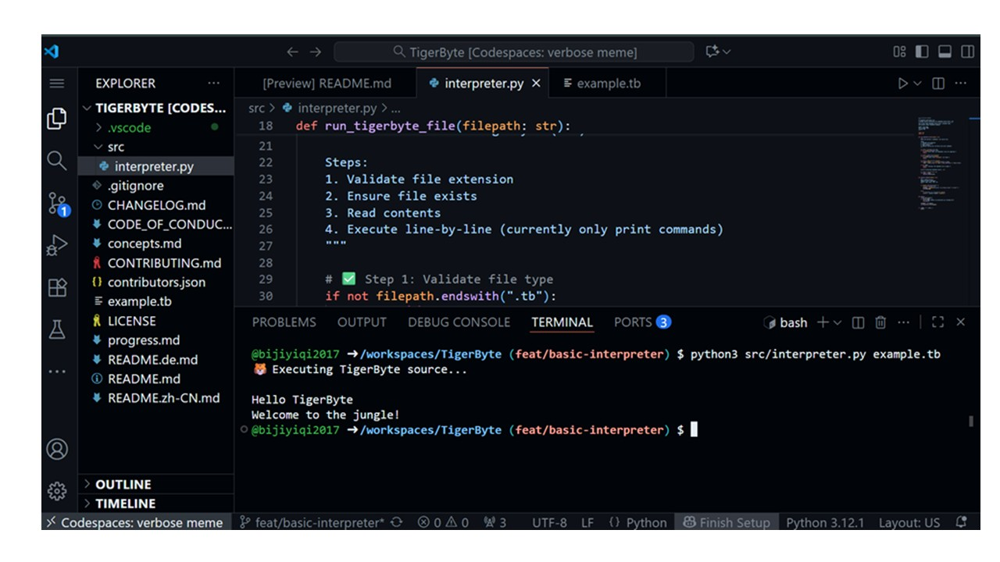

# 🐯 TigerByte

TigerByte is a multilingual, tiger-themed toy programming language, **implemented in Python**, currently in conceptual development.

## ⭐ Star the Repo

If you enjoy working with **TigerByte** or find it helpful, please give it a ⭐ on GitHub! Your support helps the project grow and keeps contributors motivated.

**Star TigerByte on GitHub**

Every star counts and encourages us to keep improving TigerByte. Thank you for your support! 🎉


## Languages
[English](./README.md) | [Deutsch](./README.de.md)

## Status
🚧 **In Development** — project shell created, core design in progress.

## Demo
Here’s a preview of the first version of the interpreter in action:



## Debug Mode

TigerByte includes a debug mode to help you understand how the interpreter works internally. Use the `--debug` flag when running a script:

```bash
tigerbyte run your_script.tb --debug
```
When enabled, the interpreter will output:

* The stream of tokens generated by the tokenizer.

* The Abstract Syntax Tree (AST) or intermediate representation created by the parser (if applicable).

## Vision
TigerByte explores how programming language design, multilingual command parsing, and creative syntax can enhance both coding and language learning.

## Planned Features
- Commands in **English**, **Mandarin**, and **German**
- Aliases for thematic verbs like `feed`, `chase`, and `say`
- Simple interpreter written in **Python**
- Educational focus on bridging natural and programming languages
- Minimal interpreter written in **Python** to execute TigerByte scripts


## File Extensions
| Emoji | Extension | Purpose |
|:--:|:--:|:--|
| 🐯 | `.tb` | Main source code files |
| 🐾 | `.cub` | Example/tutorial files |
| 📣 | `.roar` | Output/log files |
| 🏠 | `.den` | Configuration/environment files |

## Structure
- `src/` → Core interpreter logic  
- `docs/` → Design notes and supporting documents  
- `tests/` → Future testing suite  

## Project History
- **Concept Initiation:** *October 7, 2025*  
  The initial concept for TigerByte was conceived as a creative exploration into programming language design, combining multilingual commands and thematic syntax to make learning both fun and educational.

- **Repository Setup:** *October 18, 2025*  
  Project structure and documentation shell established, marking the official start of development.

## Next Steps
1. Define core command set (`feed`, `chase`, `say`, etc.) and their behavior.  
2. Design command alias mappings for English, Mandarin, and German.  
3. Build a minimal interpreter in Python to execute simple TigerByte scripts.  
4. Implement a feedback loop for command parsing and multilingual input.  
5. Expand documentation with syntax examples and language reference.


## **Contribute / Join the Team**

## 🐯 Help Shape TigerByte!

TigerByte is growing — and we want **co-maintainers** to join the adventure!  

💻 **Role:** Review PRs, mentor contributors, maintain docs & roadmap, join optional syncs  
⏰ **Time Commitment:** ~2–3 hours/week  
🧡 **Beginner-friendly & welcoming community**  

📢 Interested? Check out our [Co-Maintainers Discussion](https://github.com/bijiyiqi2017/TigerByte/discussions/22) and comment to be notified when applications open!  

🌟 Contribute, learn, and grow with TigerByte!


### Contributing

We welcome contributions from everyone! Please read our [CONTRIBUTING.md](./CONTRIBUTING.md) guide before submitting issues or pull requests.  
It includes instructions for:

- Setting up your local Python environment  
- Using TigerByte file types (`.tb`, `.cub`, `.roar`, `.den`)  
- Following our keyword conventions and multilingual command system  
- Pull request workflow and conventional commit messages

### Contributors

See our [CONTRIBUTORS.md](./CONTRIBUTORS.md) file for a list of all contributors. This file is automatically generated from `contributors.json`.

To update the contributors list:

```bash
# Navigate to the project root
cd TigerByte

# Run the generator script
python scripts/generate_contributors.py
```

The script will automatically read `contributors.json` and update `CONTRIBUTORS.md` with the latest information.

---

## 📘 TigerByte Wiki

Our Wiki is the official home for in-depth documentation, guides, and learning resources about TigerByte.

👉 **[Visit the TigerByte Wiki](https://github.com/bijiyiqi2017/TigerByte/wiki)**

It will expand after Hacktoberfest with:
- Setup & Installation
- Interpreter Internals
- Example Scripts
- Contributor Handbook

🐅 *Built with curiosity. Grown by community.*

---


## License
This project is licensed under the **MIT License** — see the [LICENSE](./LICENSE) file for details.
